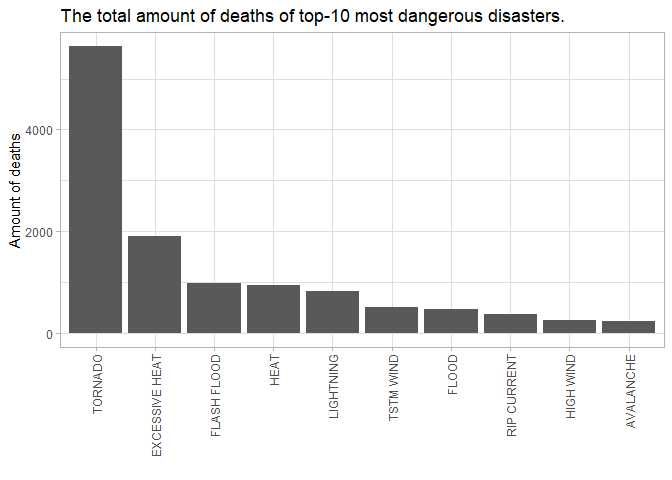
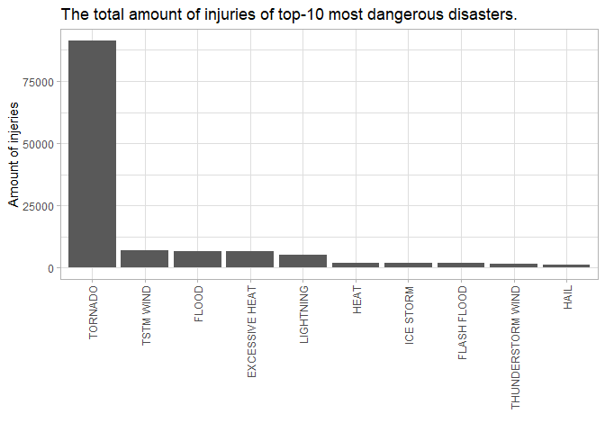

## Synopsis  

This survey focuses on health and economic impacts of natural disasters. It is based on National Weather Service Storm Data and its goal is to answer two questions:  

* Which types of events are most harmful for USA population health?
* Which types of events have the greatest economic consequences?

This paper provides result of this survey as well as R language code for data processing. 


##  Obtaining data

We will need ggplot2 and data.table libraries, let's go load them:


```r
library(data.table)
library(ggplot2)
```

As we said, in this survey we will use National Weather Service Storm Data. At first we need the data itself, the following code will download and read it. 


```r
file_url = "https://d396qusza40orc.cloudfront.net/repdata%2Fdata%2FStormData.csv.bz2"
dest_file = ".\\data\\storm_data.csv.bz2"
if(!file.exists(dest_file)){
    download.file(file_url, dest_file)
}
st_data = as.data.table(read.csv(dest_file))
```

## Data Processing

### Health casualties

We will split health casualties into two types. First one is deaths and second one is injuries. Our goal is to find out what type of events (EVTYPE) are most dangerous, i.e. leads to the highest deaths and injuries rate. 

Here is calculation amount of deaths for each event...:


```r
fatalities_dt = st_data[, list(Total.Fatalities = sum(FATALITIES)), by = EVTYPE]
setorder(fatalities_dt, -Total.Fatalities, na.last = T)
head(fatalities_dt, n = 10)
```

```
##             EVTYPE Total.Fatalities
##  1:        TORNADO             5633
##  2: EXCESSIVE HEAT             1903
##  3:    FLASH FLOOD              978
##  4:           HEAT              937
##  5:      LIGHTNING              816
##  6:      TSTM WIND              504
##  7:          FLOOD              470
##  8:    RIP CURRENT              368
##  9:      HIGH WIND              248
## 10:      AVALANCHE              224
```

... and calculation amount of injuries for each event:


```r
injuries_dt = st_data[, list(Total.Injuries = sum(INJURIES)), by = EVTYPE]
setorder(injuries_dt, -Total.Injuries, na.last = T)
head(injuries_dt, n = 10)
```

```
##                EVTYPE Total.Injuries
##  1:           TORNADO          91346
##  2:         TSTM WIND           6957
##  3:             FLOOD           6789
##  4:    EXCESSIVE HEAT           6525
##  5:         LIGHTNING           5230
##  6:              HEAT           2100
##  7:         ICE STORM           1975
##  8:       FLASH FLOOD           1777
##  9: THUNDERSTORM WIND           1488
## 10:              HAIL           1361
```

### Ecomomic impact

In Storm Dataset we can find two types of economic impact, property damage (PROPDMG) and crop damage (CROPDMG). Moreover, this dataset also has two more variables: PROPDMGEXP and CROPDMGEXP, which are coefficients (multipliers) for corresponding value. They can be interpreted as following:  

b, B <-> billion (x1.000.000.000)  
m, M <-> million (x1.000.000)  
k, K <-> thousand (x1000)  
h, H <-> hundred (x100)  
(+) <-> (x1)  
(-) <-> (x0)  
(?) <-> (x0)  
blank field <-> (x0)  

This code provides a calculation of actual damage is USD for each event:


```r
EXP = sort(unique(as.character(st_data$PROPDMGEXP)))
coefficient <- c(0,0,0,1,10,10,10,10,10,10,10,10,10,10^9,10^2,10^2,10^3,10^6,10^6)
convert = data.table("EXP" = EXP, "coefficient" = coefficient)

damage_dt = st_data[, c("EVTYPE", "PROPDMG", "PROPDMGEXP", "CROPDMG", "CROPDMGEXP")]

damage_dt$PROPCOEFFICIENT = convert$coefficient[match(damage_dt$PROPDMGEXP, convert$EXP)]
damage_dt$CROPCOEFFICIENT = convert$coefficient[match(damage_dt$CROPDMGEXP, convert$EXP)]
damage_dt$PROPDMG = damage_dt$PROPDMG * damage_dt$PROPCOEFFICIENT
damage_dt$CROPDMG = damage_dt$CROPDMG * damage_dt$CROPCOEFFICIENT
damage_dt$TOTAL = damage_dt$PROPDMG + damage_dt$CROPDMG

total_dmg_dt = damage_dt[, list(Total = sum(TOTAL)), by = EVTYPE]
setorder(total_dmg_dt, -Total, na.last = T)
head(total_dmg_dt, n = 10)
```

```
##                EVTYPE        Total
##  1:             FLOOD 150319678250
##  2: HURRICANE/TYPHOON  71913712800
##  3:           TORNADO  57352117607
##  4:       STORM SURGE  43323541000
##  5:       FLASH FLOOD  17562132111
##  6:           DROUGHT  15018672000
##  7:         HURRICANE  14610229010
##  8:       RIVER FLOOD  10148404500
##  9:         ICE STORM   8967041810
## 10:    TROPICAL STORM   8382236550
```

## Results  
### Health impact  

The best way to realize results is to visualize them.  

On two following plots top-10 event with highest death and injuries rate are shown:


```r
plot = ggplot(data = fatalities_dt[1:10,], 
                aes(x = reorder(EVTYPE, -Total.Fatalities), y = Total.Fatalities)) + 
    geom_bar(stat="identity") + 
    labs(title="The total amount of deaths of top-10 most dangerous disasters.", 
         y = "Amount of deaths", x = "") + 
    theme_light() + theme(axis.text.x = element_text(angle=90, vjust=0.5, hjust=1))
print(plot)
```

<!-- -->


```r
plot = ggplot(data = injuries_dt[1:10,], 
                aes(x = reorder(EVTYPE, -Total.Injuries), y = Total.Injuries)) + 
    geom_bar(stat="identity") + 
    labs(title="The total amount of injuries of top-10 most dangerous disasters.", 
         y = "Amount of injeries", x = "") + 
    theme_light() + theme(axis.text.x = element_text(angle=90, vjust=0.5, hjust=1))
print(plot)
```

<!-- -->

As we can see, tornados are the most dangerous disasters for population.

Next let's take a look at plot of top-10 events with highest economic impact:


```r
plot = ggplot(data = total_dmg_dt[1:10,], 
              aes(x = reorder(EVTYPE, -Total), y = Total)) + 
    geom_bar(stat="identity") + 
    labs(title="The economical consequences of top-10 most costly disasters.", 
         y = "Economical damage ($USD)", x = "") + 
    theme_light() + theme(axis.text.x = element_text(angle=90, vjust=0.5, hjust=1))
print(plot)
```

<!-- -->

Here we can see that the most costly disaster is flood. It much more expensive than the others.

Thanks for your attention! 


